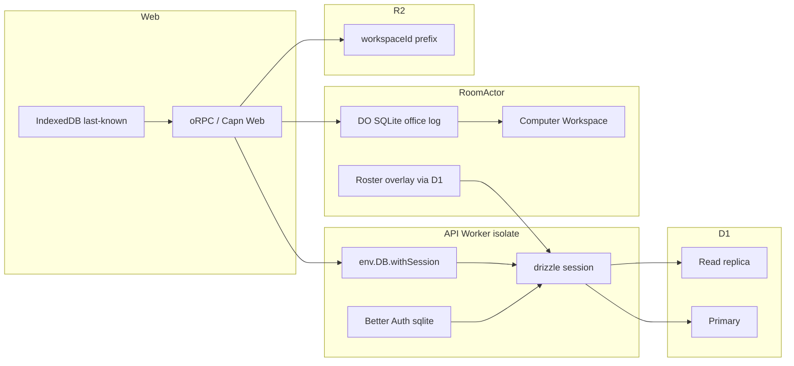

# Postgres catalog to Cloudflare D1 - Plan

## Goal Capsule

- **Objective:** Replace Neon Postgres as the shared-team SQL catalog with one Cloudflare D1 database, accessed from Workers and Durable Objects through Drizzle plus D1 Sessions.
- **Authority:** Product behavior follows this plan’s Product Contract. Actor split follows `AGENTS.md` and `docs/rooms-plan.md` except the catalog store: team data moves to D1; office transcripts, computers, and routines stay on the home `RoomActor`; knowledge stays on R2.
- **Stop when:** Hosted API Worker has no `DATABASE_URL`. Catalog reads/writes go through a D1 binding. Drizzle schema is SQLite. Offline tests pass without Docker Postgres. Docs no longer say team data lives in Postgres. A freeze-and-copy runbook exists for hosted data.
- **Execution profile:** Deep data-store migration. Schema dialect first, then adapter, then Worker wire, then cutover. Offline vitest. No live OpenRouter, Computer, TinyFish, or production D1 in CI.
- **Out of scope for this run:** Per-workspace D1 sharding, Turso/libSQL as a second dialect, Hyperdrive, moving office Pi logs or R2 knowledge into D1, product feature work.

## Product Contract

### Summary

Hosted Groxbot talks to Neon over HTTP for auth, workspaces, roster, rooms, billing, MCP, and poke threads. This plan moves that catalog to Cloudflare D1 so the Worker uses a native binding and regional read replicas via Sessions. Office chat and knowledge placement do not change.

### Problem Frame

The API Worker and `RoomActor` open Neon HTTP on every catalog access (`createNeonHttpDb`). That is a second vendor, a Postgres dialect, and a cross-network hop from Cloudflare. Team data should stay a shared SQL catalog, not Durable Object SQLite.

### Requirements

#### Catalog store

- R1. Shared team SQL (auth, organizations, roster, rooms/membership, poke/guest threads, billing/usage, MCP and plugin connections, knowledge-share rows) lives in Cloudflare D1, not Neon.
- R2. Office transcripts, computers, soul/memory, and routines stay on the home `RoomActor` (DO SQLite). Knowledge files stay on R2 `{workspaceId}/…`. Code Mode `history.search` stays in-memory on the Pi session, not D1.
- R3. Product API behavior is unchanged: same oRPC contracts, same `botId` / `roomId` split, same instant-paint client cache.

#### Access path

- R4. The API Worker and Durable Objects reach the catalog through a D1 binding, not `DATABASE_URL`.
- R5. Catalog queries that should use replicas go through D1 Sessions (`withSession`). Stock `drizzle(env.DB)` (primary only) is not the hosted path.
- R6. Local `wrangler dev` uses a local D1 database. Docker Postgres is not required for the default dev loop.

#### Self-host and tests

- R7. Node self-host (`apps/worker`, `apps/api/src/index.ts`) uses the same SQLite schema via a file or in-process SQLite driver, not a second Postgres dialect.
- R8. Automated tests stay offline. They must not require Neon, live D1, or Docker Postgres.

#### Cutover

- R9. Hosted data moves with a freeze-and-copy: export Neon, import D1, switch the Worker, then decommission Neon. Dual-write is out of v1.
- R10. Auth, hire, roster, rooms, billing status, and poke continue work after cutover with the same workspace IDs and bot IDs.

### Actors

- A1. Workspace member using web (auth cookie, roster, rooms, hire).
- A2. Home or group `RoomActor` loading roster/model overlay from the catalog during a turn.
- A3. Operator applying schema migrations and the hosted cutover.
- A4. Self-host operator running the Node worker against a local SQLite file.

### Key Flows

- F1. Hosted catalog read
  - **Trigger:** Member opens the office; Worker serves `me` / bots / rooms.
  - **Actors:** A1
  - **Steps:** Worker starts a D1 session → Drizzle select → JSON to the client. Client still paints from Query/IndexedDB first (R3).
  - **Covered by:** R1, R4, R5, R3
- F2. Hosted catalog write then read
  - **Trigger:** Member hires a bot or updates billing-adjacent rows in one request.
  - **Steps:** Same D1 session for the request; writes go to the primary; later statements in that session see them (R5).
  - **Covered by:** R5, R10
- F3. Room turn overlay
  - **Trigger:** `RoomActor` loads a bot row and model overlay.
  - **Actors:** A2
  - **Steps:** Actor uses the D1 binding (not Neon HTTP) for those selects. Pi log stays on DO SQLite (R2).
  - **Covered by:** R2, R4
- F4. Hosted cutover
  - **Trigger:** Operator runs the freeze-and-copy.
  - **Actors:** A3
  - **Steps:** Pause writes → dump Neon → import D1 → deploy Worker with D1 binding and no `DATABASE_URL` → smoke auth/hire/roster → drop Neon.
  - **Covered by:** R9, R10
- F5. Local and self-host
  - **Trigger:** Developer runs `pnpm dev` or a self-host Node process.
  - **Actors:** A3, A4
  - **Steps:** Wrangler local D1 or a SQLite file; same schema; tests use in-memory SQLite (R6–R8).
  - **Covered by:** R6, R7, R8

### Acceptance Examples

- AE1. Covers R1, R4, R5. Given a local wrangler API with a D1 binding, when the Worker lists bots for a workspace, then rows come from D1 and `DATABASE_URL` is unset.
- AE2. Covers R2. Given an office turn after cutover, when the member sends a message, then the transcript is still on the home `RoomActor` SQLite log, not a D1 table.
- AE3. Covers R5, F2. Given hire in one Worker request, when the same request reads the new bot, then the row is visible (same D1 session).
- AE4. Covers R8. Given CI with no Postgres container, when `pnpm test` and `pnpm check` run, then they pass.
- AE5. Covers R9, R10. Given a freeze-and-copy of a fixture workspace, when the Worker points at D1, then that workspace’s users, bots, `homeRoomId`s, and rooms still match.

### Scope Boundaries

- In: Drizzle SQLite schema, D1 Sessions adapter, Worker/DO/MCP/Node call sites, Better Auth sqlite provider, admin batch, wrangler D1, migrate/cutover tooling, doc updates.
- Out: Per-workspace D1, Turso, Hyperdrive, office/knowledge store moves, new product APIs, D1 FTS5 for knowledge search.

#### Deferred to Follow-Up Work

- Cross-request D1 bookmark headers on oRPC (optional; IndexedDB and cookie cache cover most lag).
- Per-workspace D1 if one database approaches 10 GB.
- Remove `infra/compose` Postgres after self-host SQLite has been used in anger.

### Success Criteria

Hosted Groxbot has one SQL catalog on D1. Office and knowledge placement are unchanged. Developers do not need Neon or Docker Postgres for the default loop. Tests stay offline.

### Dependencies

- Cloudflare Workers Paid D1 (10 GB per database, Sessions API on the Worker binding, not REST).
- `drizzle-orm` D1 driver (`prepare` / `batch` on `D1DatabaseSession`).
- Existing freeze window for hosted writes (operator-run).

## Planning Contract

### Assumptions

- One D1 database per Cloudflare account/deployment for v1. Not one D1 per workspace. Catalog size stays under 10 GB until a later shard plan.
- User chose D1 over Turso after comparing portability vs Worker-native reads. Turso is not a dual dialect in this plan.
- Default session constraint is `first-unconstrained`. Auth-critical paths that cannot tolerate replica lag use `first-primary` in the same request.
- Cross-request bookmarks are not required for v1 (R3 instant paint; Better Auth cookie cache is 5 minutes).
- Node self-host uses better-sqlite3 or `@libsql/client` against a file. Same Drizzle schema. No Postgres adapter left in `@groxbot/db`.
- Hosted cutover is operator-run, not a product UI.

### Key Technical Decisions

- KTD1. Use Cloudflare D1 as the only shared-team SQL store. (session-settled: user-directed — chosen over Turso/libSQL: Worker binding and regional Sessions reads beat another HTTP vendor; self-host keeps SQLite via a file driver.)
- KTD2. One D1 per deployment. Rejected: D1 per workspace in v1 (breaks shared billing/pricing catalog and admin purge; extra binding topology). Document the 10 GB hard cap as a follow-up trigger.
- KTD3. Hosted Drizzle is `drizzle(env.DB.withSession(constraint), { schema })`. Keep the session object to call `getBookmark()`. Rejected: `drizzle(env.DB)` (primary only; no replica routing). Drizzle has no first-class Sessions wrapper; duck-typing `prepare`/`batch` is enough (`drizzle-team/drizzle-orm#4522`).
- KTD4. Rewrite `packages/db` schema from `drizzle-orm/pg-core` to `drizzle-orm/sqlite-core`. `jsonb` columns (`messages.blocks`, `events.payload`) become `text` with JSON mode. Timestamps become integer milliseconds (Drizzle sqlite timestamp mode). Partial unique indexes stay as SQLite partial indexes. Reset Drizzle snapshots (`pnpm db:generate` on empty sqlite out dir). Do not hand-write `packages/db/drizzle/*.sql`.
- KTD5. Replace interactive `db.transaction` in `packages/core/src/admin.ts` with Drizzle `db.batch` (D1 atomic batch). Rejected: keep `db.transaction` (D1 disallows `BEGIN`).
- KTD6. Drop `DATABASE_URL` from Worker `loadEnv`. Binding name `DB`. Tests construct Drizzle against in-memory SQLite or a Miniflare D1. `apps/api/src/env.test.ts` stops requiring a Postgres URL.
- KTD7. Freeze-and-copy cutover. Rejected: dual-write (two dialects and two sources of truth during the window).
- KTD8. `docs/rooms-plan.md` “Do not add D1” becomes: D1 is the team catalog; do not put office history or knowledge search in D1. AGENTS.md kernel line follows the same split.

### High-Level Technical Design

Worker HTTP isolate and Durable Objects both receive the `DB` binding. Each request or actor method that hits the catalog creates a session, then Drizzle. Writes go to the primary. Replica reads require that session (KTD3). Office I/O never uses D1 (R2).

### Sequencing

U1 schema → U2 adapters → U3 env/wrangler → U4 call sites → U5 auth/admin → U6 tests (can start after U2) → U7 migrate/cutover tooling → U8 docs. U4 depends on U2 and U3. U5 depends on U1 and U2. U7 depends on U1. U8 last.

### Alternative Approaches Considered

- **Turso/libSQL as catalog.** Same SQLite dialect, HTTP from Workers, easier Node URL. Rejected for hosted: extra vendor; no CF replica binding; embedded replicas do not run on Workers.
- **Stay on Neon + Hyperdrive.** Fastest path if the only pain is RTT. Rejected: user asked to leave Postgres for D1.
- **Dual-write Neon and D1.** Safer cutover, high carrying cost. Rejected for v1 (KTD7).
- **Put team data on RoomActor SQLite.** Violates shared-team listing, billing, and admin. Out of identity.

### Risks & Dependencies

- Risk: 10 GB / single-writer D1. Mitigation: one catalog DB; index hot paths; batch large admin deletes; shard later if size or queue overload appears.
- Risk: Replica lag without bookmarks. Mitigation: same-request session (AE3); `first-primary` for auth session load if a stale row is unsafe; client cache (R3).
- Risk: Drizzle `transaction` leftovers. Mitigation: U5 grep for `.transaction(` and `pg-core`.
- Risk: Better Auth sqlite column types. Mitigation: follow Better Auth drizzle sqlite schema (integer timestamps) in U1/U5 together.
- Risk: `drizzle-kit` D1 HTTP has no Sessions API. Acceptable: migrations always hit primary.
- Dependency: Wrangler 4.x already in the workspace (`pnpm.overrides.wrangler`).

### System-Wide Impact

- Auth: same cookies and org plugins; adapter provider `sqlite`.
- Caching: no client change; `docs/caching.md` source-of-truth row becomes D1 instead of Postgres.
- Agents/tools: unchanged. Do not add catalog tools.
- Cardinal rules: kernel “Postgres (Neon)” becomes “D1 catalog”; still no `BotActor` product class, no knowledge in D1.

### Documentation / Operational Notes

- Cutover is a freeze window. Dump with Neon SQL export or `COPY`. Transform JSONB/timestamptz to SQLite types. Import with `wrangler d1 execute` or D1 REST (5 GB file import cap; batch if larger).
- After switch: `wrangler secret delete DATABASE_URL` (or stop setting it). Confirm Worker `env.DB`.
- Time Travel on D1 is the new PITR (30 days Paid).

### Sources & Research

- Cloudflare D1 limits: 10 GB/db, 1000 queries/invocation Paid, 100 bound parameters, 30 s query duration, single-threaded writer. https://developers.cloudflare.com/d1/platform/limits/
- D1 Sessions / read replicas (six regions; off unless `withSession`). https://developers.cloudflare.com/d1/best-practices/read-replication/
- `D1DatabaseSession` is `prepare` + `batch` + `getBookmark` (no `exec`). https://developers.cloudflare.com/d1/worker-api/d1-database/
- Drizzle official D1 guide still uses `drizzle(env.DB)` (primary only). Sessions are duck-typed.
- Current factories: `packages/db/src/neon.ts`, `packages/db/src/node.ts`, `packages/db/src/types.ts`. Worker: `apps/api/src/worker.ts`. Env: `apps/api/src/env.ts`. Schema: `packages/db/src/schema/{auth,product}.ts`. Admin tx: `packages/core/src/admin.ts`. Policy: `docs/rooms-plan.md`, `AGENTS.md`.

## Implementation Units

### U1. SQLite Drizzle schema

- **Goal:** Catalog schema compiles as sqlite-core with a fresh Drizzle snapshot series.
- **Requirements:** R1
- **Dependencies:** none
- **Files:** `packages/db/src/schema/auth.ts`, `packages/db/src/schema/product.ts`, `packages/db/drizzle.config.ts`, `packages/db/drizzle/` (replace postgres snapshots via `pnpm db:generate`), `packages/db/package.json`
- **Approach:**
  1. Switch tables to `sqliteTable`. Map `jsonb` to `text({ mode: "json" })`. Map timestamptz to integer timestamp_ms.
  2. Keep partial unique indexes. Confirm SQLite `WHERE` predicates match.
  3. Point `drizzle.config.ts` at `dialect: "sqlite"` (local generate can use a file URL; hosted apply is D1 in U7).
  4. Generate a new `0000_*.sql` chain. Do not edit SQL by hand.
- **Patterns to follow:** Existing table names and column names stay stable so cutover mapping is 1:1 aside from types.
- **Test scenarios:**
  - Schema module typechecks (`pnpm --filter @groxbot/db check`).
  - Generate produces sqlite dialect journal, not `postgresql`.
  - `messages.blocks` and `events.payload` round-trip as JSON through Drizzle.
- **Verification:** `pnpm --filter @groxbot/db check` and inspect `packages/db/drizzle/meta/_journal.json` dialect.

### U2. D1 Sessions and Node SQLite adapters

- **Goal:** `@groxbot/db` exposes D1 (hosted) and SQLite-file (Node) factories. Neon HTTP and postgres.js go away.
- **Requirements:** R4, R5, R7
- **Dependencies:** U1
- **Files:** `packages/db/src/types.ts`, `packages/db/src/d1.ts` (new), `packages/db/src/node.ts`, `packages/db/src/neon.ts` (remove), `packages/db/src/index.ts`, `packages/db/package.json`
- **Approach:**
  1. `Database` type is the sqlite Drizzle database (D1 and better-sqlite3/libsql share schema).
  2. `createD1Db(binding, constraintOrBookmark?)` calls `binding.withSession(...)` then `drizzle(session, { schema })`. Return `{ db, close, getBookmark }` so callers can keep the session bookmark (KTD3).
  3. Node `createDb(path)` uses a file or `:memory:` sqlite driver with the same schema.
  4. Delete `createNeonHttpDb` and `@neondatabase/serverless` / `postgres` deps.
- **Patterns to follow:** Current `DbHandles` `{ db, close }` plus optional `getBookmark`.
- **Test scenarios:**
  - In-memory Node sqlite: insert bot + select by id.
  - Factory defaults to `first-unconstrained` when bookmark omitted.
  - Package no longer imports `drizzle-orm/neon-http` or `postgres`.
- **Verification:** `pnpm exec vitest run packages/db` (new tests in U6 may land here).
- **Execution note:** Adapter tests first against `:memory:` sqlite so U4 is not blocked on wrangler.

### U3. Worker env and D1 binding

- **Goal:** Worker env carries `DB`, not `DATABASE_URL`.
- **Requirements:** R4, R6
- **Dependencies:** U2
- **Files:** `apps/api/wrangler.jsonc`, `apps/api/src/env.ts`, `apps/api/src/env.test.ts`, `apps/api/.dev.vars.example`, `apps/api/src/bot-actor.ts` (`WorkerEnv` / `DATABASE_URL` type)
- **Approach:**
  1. Add `d1_databases` binding `DB` with `database_name` / `database_id` (placeholder in example; real id from `wrangler d1 create`).
  2. `loadEnv` / `productEnv` require `DB` on the Worker bag. Stop throwing on missing `DATABASE_URL`.
  3. Tests pass a fake D1 or skip DB in string-only cases; do not keep a Postgres URL fixture.
- **Test scenarios:**
  - `loadEnv` without `DATABASE_URL` succeeds for string fields that remain.
  - `productEnv` exposes the D1 binding.
  - Missing `DB` on Worker construction fails closed.
- **Verification:** `pnpm exec vitest run apps/api/src/env.test.ts`

### U4. Call sites: Worker, actors, MCP, Node

- **Goal:** Every catalog user goes through U2 factories.
- **Requirements:** R1, R2, R4, R7
- **Dependencies:** U2, U3
- **Files:** `apps/api/src/worker.ts`, `apps/api/src/room-actor.ts`, `apps/api/src/bot-actor.ts`, `apps/api/src/mcp-http.ts`, `apps/api/src/index.ts`, `apps/worker/src/index.ts`, any remaining `createNeonHttpDb` / `databaseUrl` catalog uses (`rg createNeonHttpDb`, `rg databaseUrl`)
- **Approach:**
  1. Worker `fetch`: one `createD1Db(env.DB)` per request; pass `db` into `createApp` as today.
  2. `RoomActor` overlay load uses `this.env.DB` with a session, not Neon HTTP.
  3. MCP OAuth KV load/save uses the same binding.
  4. Node entrypoints use `createDb` with `DATABASE_PATH` or similar file path (R7).
  5. Do not route office `sessions`/`entries` or R2 knowledge through D1.
- **Test scenarios:**
  - `rg createNeonHttpDb` and `rg @groxbot/db/neon` are empty.
  - Room overlay select is still a catalog read (unit or actor test with sqlite fake).
  - MCP load/save still round-trips ciphertext keys.
- **Verification:** `pnpm exec vitest run` on touched API tests; grep gates in review.

### U5. Better Auth sqlite and admin batch

- **Goal:** Auth adapter and admin deletes work on D1/SQLite.
- **Requirements:** R1, R10
- **Dependencies:** U1, U2
- **Files:** `packages/auth/src/index.ts`, `packages/core/src/admin.ts`, `packages/core/src/admin.ts` tests if present, `apps/api/src/admin-purge.ts`
- **Approach:**
  1. `drizzleAdapter(db, { provider: "sqlite", schema: … })`.
  2. Rewrite `commitAdminUserDelete` and `purgeDeploymentData` as ordered `db.batch([...])` statements that preserve today’s semantics (KTD5). Sidecar DO/R2 cleanup stays outside the batch (`admin-purge.ts`).
  3. Health check `sql\`select 1\`` stays valid on SQLite.
- **Test scenarios:**
  - Auth adapter provider is `sqlite`.
  - User delete: sole workspaces removed; shared rooms reassigned; user row gone; all-or-nothing if a statement fails (batch abort).
  - Purge: orgs/users gone; `billing_plans` / `model_pricing` remain.
- **Verification:** `pnpm exec vitest run packages/core/src/admin.ts` (add `admin.test.ts` if missing) and auth package check.

### U6. Offline tests and live-test swap

- **Goal:** `pnpm test` never needs Postgres. Live API tests use sqlite or skip.
- **Requirements:** R8
- **Dependencies:** U2, U5
- **Files:** `apps/api/src/bots.live.test.ts`, `packages/core/src/mcp-oauth.test.ts`, any test that embeds `postgres://`, `vitest.config.ts` if needed, new `packages/db` adapter tests
- **Approach:**
  1. Replace `createDb("postgres://…")` probes with in-memory sqlite.
  2. Keep `ScriptedAgentRuntime` offline.
  3. Do not add Miniflare D1 to CI unless a test cannot run on better-sqlite3; prefer one sqlite driver in unit tests.
- **Test scenarios:**
  - `pnpm test` exits 0 with no listener on `127.0.0.1:5433`.
  - mcp oauth kv tests still pass on sqlite.
  - Covers AE4.
- **Verification:** `pnpm test` and `pnpm check`.

### U7. Migrations, local D1, cutover script

- **Goal:** Operators can migrate schema to D1 and copy hosted Neon data once.
- **Requirements:** R6, R9, R10
- **Dependencies:** U1, U3
- **Files:** `packages/db/drizzle.config.ts` (d1-http credentials for apply), `apps/api/.dev.vars.example`, `infra/compose/docker-compose.yml` (stop being required; comment or leave unused), new operator doc section in U8, optional `packages/db` dump/transform script (no secrets in repo)
- **Approach:**
  1. `wrangler d1 create` + local `--local` execute of generated SQL for `pnpm dev`.
  2. Remote apply via `drizzle-kit` `driver: "d1-http"` or `wrangler d1 execute --file` on generated SQL. Primary only (KTD3 does not apply to kit).
  3. Cutover script: read Postgres dump, coerce JSON/timestamps, insert in batched statements under the 100-parameter and 30 s limits. Idempotent on primary keys.
  4. Covers F4 / AE5 against a fixture, not production, in CI if the fixture is tiny; otherwise a documented dry-run command.
- **Test scenarios:**
  - Generated SQL applies to empty sqlite/D1 local.
  - Fixture workspace IDs survive dump → sqlite insert (AE5).
  - Batch splitter respects 100 bound parameters.
- **Verification:** Local `wrangler d1 execute --local` of U1 SQL; fixture transform test.
- **Execution note:** Prove the transform on a synthetic dump in vitest. Do not point CI at groxbot.com Neon.

### U8. Docs and kernel wording

- **Goal:** AGENTS, rooms plan, caching, README, and `.dev.vars.example` describe D1 as the catalog.
- **Requirements:** R2, R6
- **Dependencies:** U3, U7
- **Files:** `AGENTS.md`, `docs/rooms-plan.md`, `docs/caching.md`, `README.md`, `apps/api/.dev.vars.example`, `packages/seo` FAQ strings that require Neon `DATABASE_URL` if they would ship a lie
- **Approach:** Per KTD8: team catalog is D1; office is DO SQLite; knowledge is R2; history.search is not D1. Schema workflow: sqlite generate/migrate. Remove “Worker uses Neon HTTP” from `.dev.vars.example`.
- **Test scenarios:**
  - `docs/rooms-plan.md` no longer forbids D1 for the team catalog.
  - `AGENTS.md` still forbids D1 for office `history.search` and knowledge.
  - SEO/local FAQ does not require Neon to start (or is marked hosted-only if still true for an old path).
- **Verification:** Doc grep for `DATABASE_URL`, `Neon`, `Do not add D1`; `pnpm --filter @groxbot/seo test` if FAQ strings change.

## Verification Contract

- `pnpm --filter @groxbot/db check` after U1.
- `pnpm exec vitest run apps/api/src/env.test.ts` after U3.
- `pnpm exec vitest run packages/core packages/auth packages/db apps/api` after U4–U6.
- Full `pnpm test` and `pnpm check` before cutover (AE4).
- Grep gates: no `createNeonHttpDb`, no `drizzle-orm/pg-core`, no `provider: "pg"`, no required Worker `DATABASE_URL`.
- Cutover: AE5 on a fixture dump, then a hosted freeze window (U7). Not in CI against production.

## Definition of Done

- Hosted Worker catalog path is D1 Sessions + Drizzle (KTD1, KTD3). `DATABASE_URL` is gone from Worker env (R4).
- Schema is sqlite-core with generated snapshots (KTD4).
- Admin deletes use batch (KTD5). Better Auth is sqlite (U5).
- Office transcripts and R2 knowledge are unchanged (R2, AE2).
- `pnpm test` and `pnpm check` pass without Postgres (R8, AE4).
- AGENTS.md and rooms-plan match KTD8.
- Cutover runbook exists and was exercised on a fixture (R9, AE5).
- Abandoned Neon adapter code and unused `postgres` / `@neondatabase/serverless` dependencies are removed.
- Dead-end Turso or dual-dialect code is not left in the tree.
